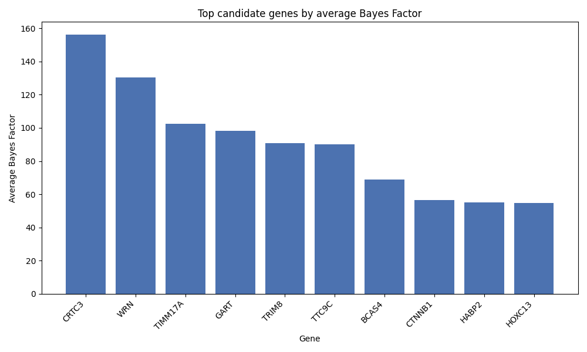
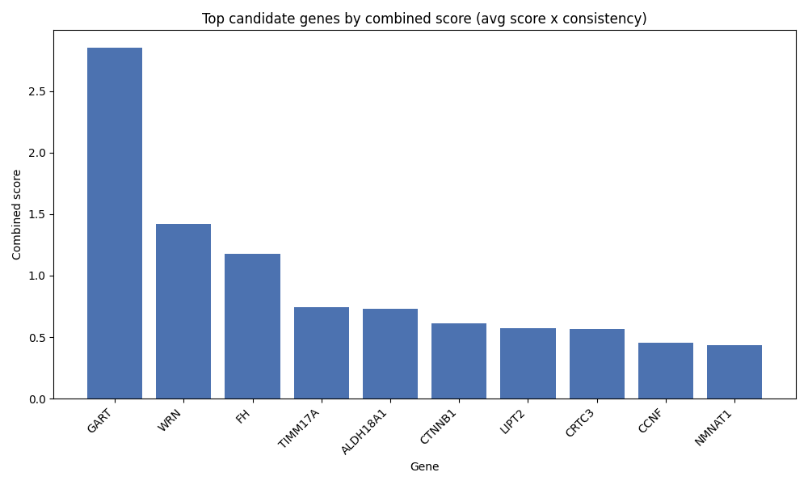

# Cancer-Selective Essential Gene Finder

Some genes keep cancer cells alive but aren't needed by normal cells at all. Knock one out, and in theory the tumor dies while healthy tissue stays fine. That's the target this project is hunting for.

The catch is proving the second half that a gene is actually safe to remove from normal cells. That takes real data on enough normal cells to be sure. Skip that step, and "safe" just means "I didn't check," which isn't the same thing. Get it wrong, and the list isn't cancer-specific at all it's just genes every cell needs, dressed up as a discovery.

This project uses public CRISPR essentiality screens (BioGRID ORCS) to make that comparison for real: genes essential in cancer screens that never show up as essential in normal-cell screens.

## Contents

- [What it does, step by step](#what-it-does-step-by-step)
- [Two scoring methods](#two-scoring-methods)
- [Results](#results-this-run)
- [Biological insights](#biological-insights-short-version)
- [How this could be used](#how-this-could-be-used)
- [Project structure](#project-structure)
- [Quick start](#quick-start)
- [Configuration](#configuration)
- [Origin](#origin)

## What it does, step by step

1. **Narrow down the screens.** BioGRID ORCS has all kinds of CRISPR
   screens — drug resistance, viral infection, differentiation — and I
   only want the ones actually measuring essentiality: gene
   knockout/inhibition, proliferation as the outcome, no drug added, and
   scored with Bayes Factor so every screen is comparable.
2. **Split into cancer vs. normal** using the `CELL_TYPE` column (matching
   Cancer/Leukemia/Carcinoma/Lymphoma/Melanoma/Glioma/Sarcoma).
3. **Read every screen file** and build a per-gene score for each group —
   cancer and normal — counting a gene as a "hit" only if its Bayes Factor
   clears `BF_THRESHOLD` (default 5).
4. **Take the difference.** Genes that were a hit in cancer screens but
   never a hit in any normal-cell screen become my candidate list.
5. **Filter out pan-essential genes** — genes basically every cell needs
   (ribosomes, spliceosome, DNA replication machinery). These can sneak
   through step 4 just because my normal-screen sample is small, not
   because they're actually safe. I remove them using:
   - DepMap's `CRISPRInferredCommonEssentials` reference list
   - A backup regex/name check for common housekeeping gene families
6. **Rank and export** what's left by two scores (below), save it to CSV,
   and plot the top genes from each.

## Two scoring methods

- **`average_score`** — the mean Bayes Factor across screens where the
  gene was a hit. Basically: "when it does show up, how strong is it?"
- **`combined_score`** — average score multiplied by how often the gene
  shows up (`screens hit / total screens`). This one answers "how strong
  *and* how consistent is it?" and it punishes genes that only looked
  good in one lucky screen.

## Results (this run)

Full ranked list: [`outputs/cancer_specific_genes.csv`](outputs/cancer_specific_genes.csv).

**Top 10 by average score:**



**Top 10 by combined score:**



**Take these with a grain of salt — this is exploratory, not a validated
target list:**
- Passing every filter here means "well-supported by this dataset," not
  "proven to kill cancer cells." The Bayes Factor measures relative
  dropout in a pooled screen — a proxy for reduced fitness, which could
  mean cell death, slowed growth, or something else entirely. Actual cell
  death needs a follow-up assay.
- The normal-cell side of the data is thin — about 87 screens vs. 275
  cancer screens — so "never a hit in normal screens" sometimes just
  means "wasn't tested enough," not "genuinely safe."
- Anything worth taking seriously from this list should get checked
  against the literature and DepMap's per-cell-line data first.

## Biological insights (short version)

My two rankings picked different "top" genes, and figuring out why taught
me the most. The average-score chart puts CRTC3 first — but that gene
only showed up as a hit in **1** screen, so it might just be a fluke, not
a real pattern. The combined-score chart only trusts a gene if it shows
up in *multiple* screens, and there, **GART** wins instead — backed by 8
separate screens all agreeing. That's the result I'd actually bet on.

After GART and WRN, the results flatten out into a big cluster where
every gene looks about the same — that's not a real ranking anymore,
that's just noise. The reason comes down to data: I only had 87
normal-cell screens to work with, so I can't always tell if a gene is
truly "safe" in normal cells or if I just didn't test it enough times.
That's why I brought in DepMap's much larger reference list — to catch
the common, everyday-essential genes my own data was too small to spot
on its own.

**Full breakdown with numbers is in
[`BIOLOGICAL_INSIGHTS.md`](BIOLOGICAL_INSIGHTS.md).**

## How this could be used

- As a **first-pass filter** — shrink ~20,000 human genes down to a
  short list worth actually researching by hand.
- As a **teaching example** of the essentiality-screen workflow: filter
  the index → score each screen → compare cancer vs. normal → strip out
  pan-essential genes.
- As a **starting point, not an answer** — real target discovery needs
  literature review, checking whether the gene only matters in a specific
  cancer subtype, and lab validation.

## Project structure

```
├── main.py                  # pipeline entry point — run this
├── config.py                # all paths and thresholds
├── src/
│   ├── data_loader.py       # screen index loading + filtering + cancer/normal split
│   ├── gene.py               # Gene class: accumulates scores across screens
│   ├── screen_processor.py   # reads screen files, builds gene_id -> Gene map
│   ├── filters.py            # cancer-specific / DepMap / housekeeping filters
│   └── visualize.py          # bar chart plots
├── outputs/
│   ├── cancer_specific_genes.csv
│   └── plots/
│       ├── top_genes_avg_score.png
│       └── top_genes_combined_score.png
├── screens_biogrid/          # data folder (not in git — see below)
├── dryrun.ipynb              # the original exploratory notebook
└── requirements.txt
```

## Quick start

```bash
git clone <this-repo-url>
cd CRISPR
pip install -r requirements.txt
```

### Get the data (not included in the repo)

1. Download the full human BioGRID ORCS screen archive and extract every
   file into `screens_biogrid/`:
   https://downloads.thebiogrid.org/Download/BioGRID-ORCS/Latest-Release/BIOGRID-ORCS-ALL-homo_sapiens-LATEST.screens.tar.gz
   (~2.7GB, ~1900 files — that's why it's not committed to git)
2. Download DepMap's common-essential gene list
   (`CRISPRInferredCommonEssentials.csv`) from the DepMap Data Portal
   (https://depmap.org/portal/download/) and drop it in `screens_biogrid/`
   too. Optional — the pipeline still runs without it, just with a
   weaker pan-essential filter.

### Run it

```bash
python main.py
```

All paths come from `config.py`, resolved relative to the project folder
— so this runs the same no matter where you launch it from, as long as
`screens_biogrid/` has the data in it.

## Configuration

Everything tunable lives in `config.py`:

| Parameter | Default | Meaning |
|---|---|---|
| `BF_THRESHOLD` | 5 | Minimum Bayes Factor to count a gene as a hit in one screen |
| `TOP_N` | 10 | How many top genes to show in the plots |

## Origin

This started as exploratory work in `dryrun.ipynb` — I kept the notebook
in the repo as a record of how I actually got here, dead ends included
(like discovering that raw score ranking mostly just surfaces
housekeeping genes). `main.py` and `src/` are the cleaned-up, reproducible
version of that same logic.

## Author

Shivani Patel — 2026
